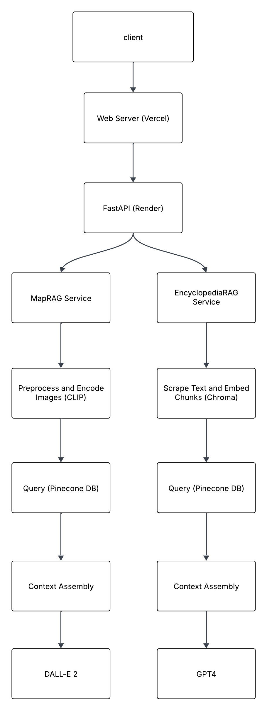

<p align="center">
  
  <h3 align="center">
    <a href="">Ski Sage Summit</a>
  </h3>
</p>


## Built With

This section should list any major frameworks/libraries used to bootstrap your project. Leave any add-ons/plugins for the acknowledgements section. Here are a few examples.

* [![Next][Next.js]][Next-url]
* [![React][React.js]][React-url]
* [![FastAPI][FastAPI]][FastAPI-url]
* [![TailwindCSS][TailwindCSS]][TailwindCSS-url]


## Getting Started Locally

First, create and activate a virtual environment:

```bash
python3 -m venv venv
source venv/bin/activate
```

Then, install the dependencies:

```bash
npm install
# or
yarn
# or
pnpm install
```

### Environment Variables

Create a `.env` file in the backend directory:

```bash
OPENAI_API_KEY=
ANTHROPIC_API_KEY=
PINECONE_API_KEY=
```

Create a `.env` file in the frontend directory
```bash
NEXT_PUBLIC_BACKEND_URL=
```

Then, run the development server (python dependencies will be installed automatically here):

```bash
npm run dev
# or
yarn dev
# or
pnpm dev
```

Open [http://localhost:3000](http://localhost:3000) with your browser to see the result.

The FastApi server will be running on [http://127.0.0.1:8000](http://127.0.0.1:8000) – feel free to change the port in `package.json` (you'll also need to update it in `next.config.js`).

## Data Sources

- Wikipeadia, White Planet: A Mad Dash through Modern Global Ski Culture by Leslie Anthony, Physiology of Alpine Skiing by Ross E. Andersen and David L. Montgomery, Physiology of alpine skiing by Turnbell et al
- Maps from various California Ski Resorts and Canadian Ski Resorts

## Key Features

### Chat Management
Users can create new conversations, view their chat history, and easily manage previous interactions. The intuitive interface allows for seamless switching between ongoing conversations and starting fresh ones. All conversations are saved automatically and can be deleted when no longer needed, giving users complete control over their interaction history.

### Encyclopedia RAG Model
The Ski Encyclopedia Mode uses a sophisticated Retrieval-Augmented Generation system to provide accurate, context-aware responses to skiing-related queries. Drawing from extensive skiing literature, it offers expert instruction on techniques, equipment, safety, and ski culture. The system combines vector-based retrieval with GPT-4 Turbo's reasoning to deliver highly relevant, factual information.

### Map Generation RAG Model
The Trail Map Mode leverages a specialized RAG system for retrieving and generating custom ski trail maps. Using CLIP image embeddings and DALL-E 3, it can create personalized trail maps based on user requirements like terrain type, difficulty level, and specific features. This combination of retrieval and generation produces accurate, visually appealing maps tailored to user preferences.


## Architecture



## Text Processing Pipeline
The project uses a sophisticated text processing pipeline to prepare documents for the RAG (Retrieval-Augmented Generation) system. Here's how it works:

1. **Document Collection**
   - Place your source documents (PDF or TXT files) in the `data/texts` directory
   - Supported formats: PDF and TXT files
   - Documents can contain ski-related information, guides, or encyclopedic content

2. **Processing Pipeline**
   The pipeline processes documents through several stages:

   a. **Text Extraction & Processing**
      - Extracts raw text from PDFs and TXT files
      - Preserves document structure
      - Stores processed documents with metadata

   b. **Text Chunking**
      - Chunk Size: 1000 characters
      - Overlap: 200 characters
      - Intelligent splitting using recursive character text splitter
      - Preserves semantic boundaries using multiple separators:
        - Paragraphs (\n\n)
        - Lines (\n)
        - Sentences (., !, ?)
        - Clauses (,)
        - Words ( )

   c. **Vector Embedding**
      - Uses all-MiniLM-L6-v2 (384 dimensions) from chroma
      - Batch processing (100 chunks per batch)
      - Each chunk stored with:
        - Unique ID
        - Vector embedding
        - Metadata (title, source, chunk index)

   d. **Storage**
      - Vector store: Pinecone (serverless, AWS us-east-1)
      - Processed documents: `data/texts/processed/`
      - Text chunks: `data/texts/chunks/`
      - Vector embeddings: Stored in Pinecone index

3. **Running the Pipeline**
   ```bash
   # Ensure you have set up your environment variables
   export PINECONE_API_KEY='your-api-key'
   
   # Run the processing pipeline
   python backend/text_processor.py
   ```

The processed data is used by the Ski Encyclopedia Mode to provide accurate, context-aware responses to skiing-related queries.

## Encyclopedia RAG Model

The Ski Encyclopedia Mode uses a sophisticated Retrieval-Augmented Generation (RAG) system to provide accurate, context-aware responses to skiing-related queries. Here's a detailed breakdown of how it works:

### Architecture Overview

1. **Embedding Model**
   - Model: all-MiniLM-L6-v2 (384 dimensions)
   - Implementation: SentenceTransformer via ChromaDB
   - Purpose: Converts text chunks and queries into semantic vectors

2. **Vector Database**
   - Platform: Pinecone (Serverless)
   - Index Configuration:
     - Metric: Cosine Similarity
     - Dimensions: 384
     - Region: AWS us-east-1

3. **Language Model**
   - Model: GPT-4 Turbo
   - Role: Expert skiing instructor and guide
   - Temperature: 0.7 (balanced between creativity and accuracy)

### Processing Pipeline

1. **Document Processing**
   - Supports PDF and TXT formats
   - Extracts clean text while preserving structure
   - Stores processed documents with metadata

2. **Text Chunking**
   - Chunk Size: 1000 characters
   - Overlap: 200 characters
   - Intelligent splitting using recursive character text splitter
   - Preserves semantic boundaries using multiple separators:
     - Paragraphs (\n\n)
     - Lines (\n)
     - Sentences (., !, ?)
     - Clauses (,)
     - Words ( )

3. **Vector Embedding**
   - Batch processing (100 chunks per batch)
   - Each chunk stored with:
     - Unique ID
     - Vector embedding
     - Metadata (title, source, chunk index)

### Query Pipeline

1. **Query Processing**
   - User query converted to embedding vector
   - Semantic search in Pinecone index
   - Retrieves top 5 most relevant chunks

2. **Context Assembly**
   - Combines retrieved chunks
   - Maintains original text integrity
   - Preserves source attribution

3. **Response Generation**
   - System prompt enforces:
     - Practical, actionable advice
     - Clear technical explanations
     - Safety considerations
     - Proper skiing terminology
   - Generates responses grounded in retrieved context

## Image RAG Model

The Trail Map Mode uses an advanced Retrieval-Augmented Generation (RAG) system to retrieve and generate ski trail maps based on user queries. Here's how it works:

### Architecture Overview

1. **Embedding Model**
   - Model: CLIP (Contrastive Language-Image Pre-training) by OpenAI
   - Implementation: Hugging Face's transformers (clip-vit-base-patch32)
   - Purpose: Creates joint embeddings of images and text for semantic matching

2. **Vector Database**
   - Platform: Pinecone (Serverless)
   - Index Configuration:
     - Metric: Cosine Similarity
     - Dimensions: 512
     - Region: AWS us-east-1

3. **Image Generation Model**
   - Model: DALL-E 3
   - Role: Generate enhanced ski trail maps
   - Quality: HD with 1024x1024 resolution

### Processing Pipeline

1. **Image Processing**
   - Supports PNG format for trail maps
   - Processes images through CLIP to create embeddings
   - Extracts metadata from filenames and structure

2. **Metadata Extraction**
   - Analyzes image filenames to identify features:
     - Terrain types (back-side, front-side, expert)
     - Location features (lake views, specific resorts)
   - Stores metadata in JSON format for quick reference

3. **Vector Embedding**
   - Batch processing (10 images per batch)
   - Each image stored with:
     - Unique ID (based on filename)
     - Vector embedding (512 dimensions)
     - Metadata (filepath, extracted features)

### Query Pipeline

1. **Query Processing**
   - User text query converted to CLIP text embedding
   - Feature extraction to identify terrain types, difficulty levels, landscape features, and amenities
   - Semantic search in Pinecone index for similar maps

2. **Context Assembly**
   - Retrieves top 3 most relevant map images
   - Extracts key features from the maps to inform generation
   - Assigns weights to reference images based on similarity scores

3. **Map Generation**
   - Constructs an enhanced prompt including:
     - Extracted terrain features
     - Trail difficulty markings
     - Landscape elements
     - Standard ski map conventions (color-coding, lift symbols)
   - Generates a new, customized ski trail map using DALL-E 3
   - Returns a high-resolution image URL for display


[Next.js]: https://img.shields.io/badge/next.js-000000?style=for-the-badge&logo=nextdotjs&logoColor=white
[Next-url]: https://nextjs.org/
[React.js]: https://img.shields.io/badge/React-20232A?style=for-the-badge&logo=react&logoColor=61DAFB
[React-url]: https://reactjs.org/
[FastAPI]: https://img.shields.io/badge/FastAPI-005571?style=for-the-badge&logo=fastapi
[FastAPI-url]: https://fastapi.tiangolo.com/
[TailwindCSS]: https://img.shields.io/badge/Tailwind_CSS-38B2AC?style=for-the-badge&logo=tailwind-css&logoColor=white
[TailwindCSS-url]: https://tailwindcss.com/
